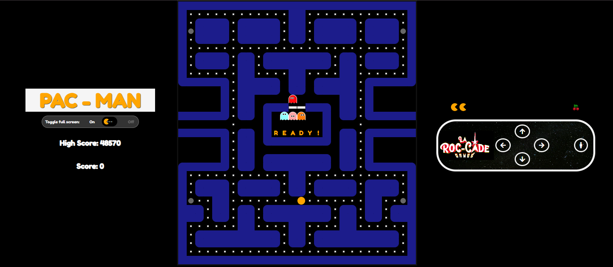

# Pac-Man JavaScript

A modern, vanilla JavaScript implementation of the classic Pac-Man arcade game, built with Vite.



## Features

- Classic Pac-Man gameplay
- Responsive design for desktop and mobile
- High score tracking with local storage
- Sprint board and issue tracking with GitHub Projects

## Getting Started

### Prerequisites

- [Node.js](https://nodejs.org/) (v16 or higher recommended)
- [npm](https://www.npmjs.com/)

### Installation

1. Clone the repository:
   ```bash
   git clone https://github.com/MichaelLarocca/pac-man-javascript-laroccade.git
   cd pac-man-javascript-laroccade